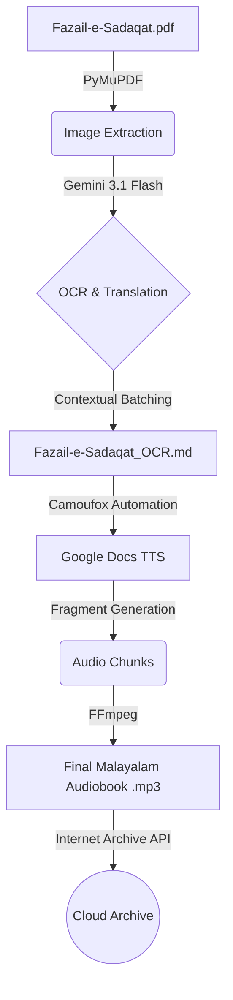

# 📚 Gemini Book Toolkit
### *Islamic Literature OCR & TTS Pipeline*

[](https://python.org)
[](https://ai.google.dev/)
[](https://camoufox.com)
[](https://github.com/astral-sh/uv)

An end-to-end automation pipeline designed to transform Urdu/Arabic Islamic literature (like *Fazail-e-Sadaqat*) into professional, TTS-optimized Malayalam audiobooks.

---

## 🚀 Key Features

*   **🔍 Vision-Powered OCR**: Leverages Gemini 3.1 Flash-Lite to extract and translate complex Urdu/Arabic typography with high fidelity.
*   **🧠 Contextual Continuity**: Intelligent multi-page batching that maintains context between pages, ensuring split sentences are reconstructed seamlessly.
*   **🎙️ TTS-Optimized Scripting**: 
    *   100% Malayalam script enforcement (no foreign characters).
    *   Automatic expansion of honorifics (ﷺ, ؓ, etc.) into full Malayalam text.
    *   Numeral-to-word conversion for natural speech.
    *   Prosodic pause injection for chapter headers.
*   **🤖 Browser Automation**: Uses **Camoufox** to drive Google Docs' high-quality TTS engine, bypassing standard API limitations.
*   **⚡ High-Throughput Pipeline**: Multi-threaded processing with exponential backoff and smart rate-limiting to maximize API efficiency.
*   **☁️ Archive Integration**: Automated uploads to Internet Archive with metadata synchronization.

---

## 🛠️ Project Architecture



---

## 📦 Installation

This project uses `uv` for ultra-fast dependency management.

```bash
# 1. Clone & Enter
git clone <repository-url>
cd gemini

# 2. Setup Virtual Environment
uv venv
source .venv/bin/activate

# 3. Install Dependencies
uv pip install -r requirements.txt  # Or manually install:
uv pip install google-genai pymupdf camoufox internetarchive
```

---

## ⚙️ Configuration

Create a `.env` file or export the following variables:

| Variable | Description |
| :--- | :--- |
| `GOOGLE_API_KEY` | Your Google AI Studio API Key. |
| `MISTRAL_API_KEY` | Required for `ocr.py` (if using Mistral fallback). |
| `IA_ACCESS_KEY` | Internet Archive S3 Access Key. |
| `IA_SECRET_KEY` | Internet Archive S3 Secret Key. |

---

## 📖 Usage Guide

### 1. OCR Extraction & Translation
Processes the source PDF and generates a TTS-ready Markdown file.
```bash
uv run ocr.py
```
*Configurable in `ocr.py`: `MAX_WORKERS`, `PAGES_PER_BATCH`, and `WAVE_DELAY`.*

### 2. Audio Generation
Converts the Markdown text into high-quality audio fragments.

**First-time Login (Headful):**
```bash
uv run tts.py --login
```

**Generate Audio:**
```bash
uv run tts.py Fazail-e-Sadaqat_OCR.md
```
*This will generate multiple MP3 chunks and automatically concatenate them using FFmpeg.*

### 3. Archive Synchronization
Upload the results to Internet Archive.
```bash
uv run archive_upload.py
```

---

## 🛠️ Utility Scripts

| Script | Purpose |
| :--- | :--- |
| `list_models.py` | Lists available Gemini models for your API key. |
| `clean.py` | Sanitizes extracted text for better TTS compatibility. |
| `comfi.py` | Modal-powered app for ComfyUI image editing (Bonus). |
| `sample.py` | Quick test for Gemini API connectivity. |

---

## 📜 License

[MIT License](LICENSE) — Created with ❤️ for the Malayalam-speaking community.
